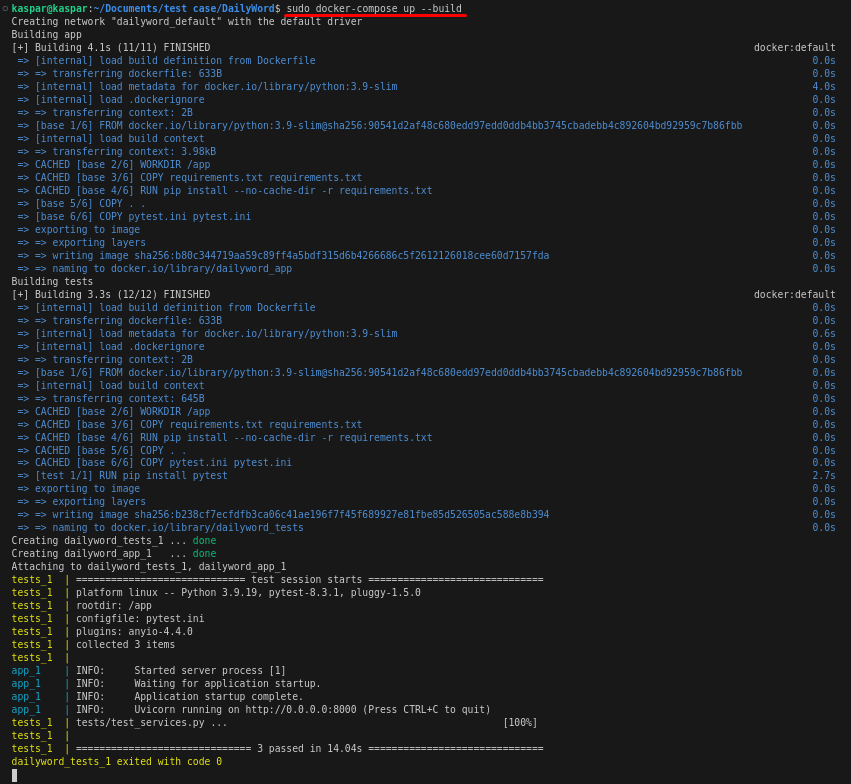
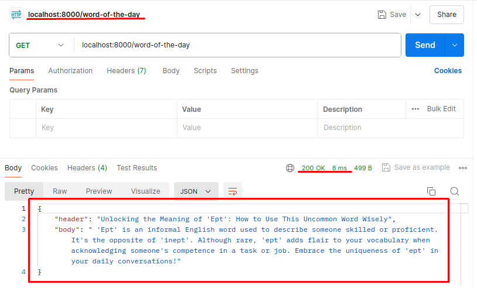
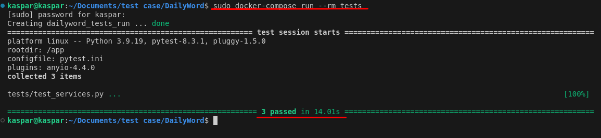

# Word of the Day Article API

## Overview

The Word of the Day Article API is a FastAPI application that fetches the "Word of the Day" from Wordsmith's RSS feed and generates an article using OpenAI's GPT-3.5-turbo model. The application caches the article to reduce API calls and updates the cache daily at midnight.

## Prerequisites

- Docker
- Docker Compose

## Setup

1. **Extract the provided ZIP archive.**

2. **Insert your OpenAI API key:**
   
   - Open the `.env` file in the project root.
   - Insert your OpenAI API key into the `OPENAI_API_KEY` variable:
     ```env
     OPENAI_API_KEY=your_openai_api_key
     WORDSMITH_RSS_FEED=https://wordsmith.org/awad/rss1.xml
     CACHE_TTL=86400  # Cache Time-to-Live in seconds (24 hours)
     ```

3. **Build and run the Docker containers:**

    ```sh
    docker-compose up --build
    ```

    The API will be available at `http://localhost:8000/word-of-the-day`.

## Running Tests

1. **Ensure you have Docker installed.**

2. **Run the tests using Docker Compose:**

    ```sh
    docker-compose run --rm tests
    ```

## Usage

- **Endpoint:** `/word-of-the-day`
- **Method:** `GET`
- **Response:**

    ```json
    {
        "header": "Word of the Day",
        "body": "An explanation of the word of the day."
    }
    ```

## Approach and Methods

### Fetching the Word of the Day

The `fetch_word_of_the_day` function fetches the "Word of the Day" and its description from the Wordsmith RSS feed.

### Generating the Article

The `generate_article` function uses OpenAI's GPT-3.5-turbo model to generate an article with a header around 50 characters and a body up to 300 characters. The prompt used ensures that the article does not include labels and that the body is relevant and complete.

### Caching

The application uses `cachetools.TTLCache` to cache the generated article for 24 hours. The cache is updated daily at midnight using APScheduler.

### FastAPI Application

The FastAPI application initializes the cache by generating the article on startup. It also includes an endpoint to retrieve the cached article.

### Scheduler

The APScheduler library is used to schedule the cache update at midnight every day.

### Application Startup

When the application starts, it performs the following steps:

1. **Start Scheduler:** The scheduler is started to handle daily cache updates.
2. **Generate Initial Article:** The application generates and caches the article immediately to ensure it's available from the first request.


## Points for Improvement

1. **Error Handling:** Enhance error handling in the API, especially for network issues and API rate limits.
2. **Logging:** Implement logging for better debugging and monitoring.
3. **Scalability:** Consider using a distributed caching mechanism like Redis for scalability.
4. **Security:** Ensure the OpenAI API key is stored securely and not exposed in logs or error messages.
5. **Testing:** Add more comprehensive tests, including integration tests.

## Screenshots

### Docker Build



### API Response using Postman



### Test Results



